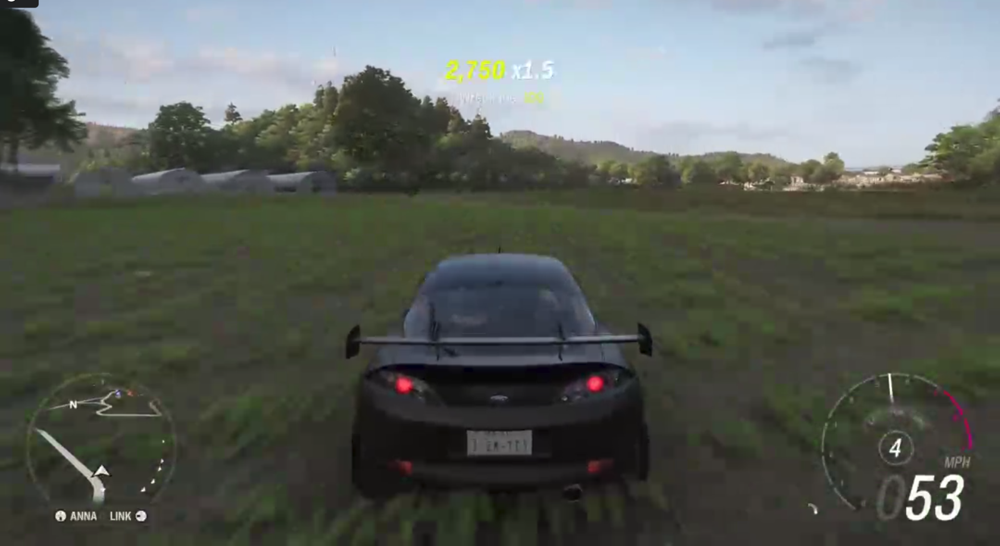
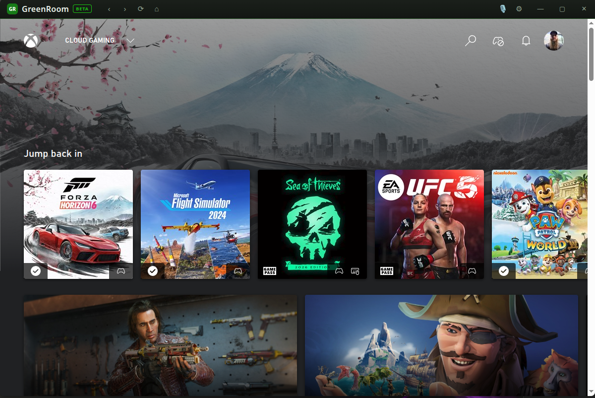
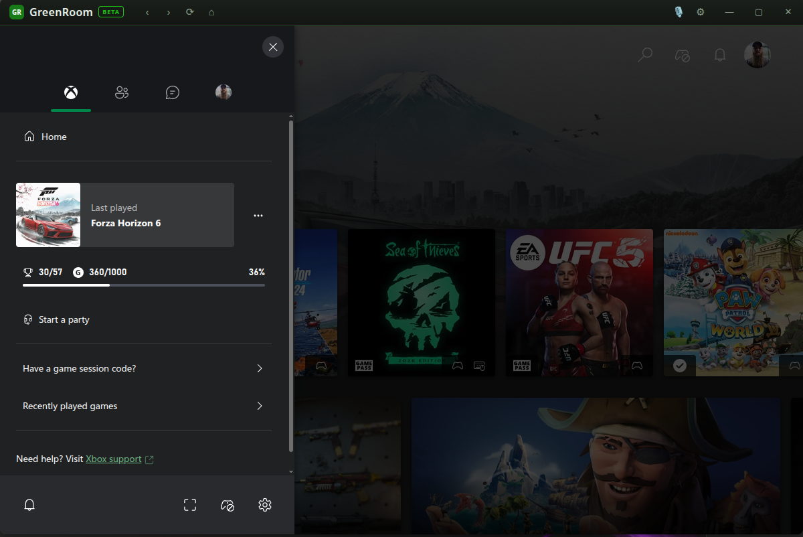

# GreenRoom <sub>BETA</sub>

**Play Game Pass and run Xbox party chat on Linux and Steam Deck — one app.**

GreenRoom wraps Microsoft's official web Xbox experience (`xbox.com/play`)
in a hardened, Game Bar–style desktop app. Sign in with your normal
Microsoft account and you get **party voice chat** with your Xbox friends
*and* **Xbox Cloud Gaming** at the maximum quality Microsoft serves — with
gaming conveniences a browser tab can't give you: push-to-talk hotkeys, a
pinnable in-game HUD, a system tray that keeps the party alive, and
hardware-decoded streaming.

> **Honesty first:** GreenRoom is an independent project, **not affiliated
> with, endorsed by, or sponsored by Microsoft**. Xbox is a trademark of
> Microsoft Corporation. Under the hood this is Microsoft's official web
> app rendered in a hardened Chromium shell — we don't touch the protocol,
> your credentials, or your traffic. An active Game Pass subscription is
> required for cloud gaming (party chat is free).

## Screenshots

**Cloud gaming** — Game Pass titles stream right in the app (Forza Horizon,
controller and all):



**The app** — the full Xbox experience in a Game Bar–style shell:



**Party chat** — start a party from the social panel, exactly like on Xbox:



**The Game Bar HUD** — `Ctrl+Shift+G` while gaming: mic toggle, party-audio
light, and a 📌 pin, in a translucent pill you can drag anywhere. The full
app stays tucked away in the tray:


## Features

### Gaming
- 🎮 **Xbox Cloud Gaming** — Game Pass titles stream over WebRTC (no DRM
  plugin needed), controller and all
- 🚀 **Unlocked stream quality** — Xbox rations unknown browsers to a blurry
  ~5 Mbps; GreenRoom negotiates up to Xbox's real ~25 Mbps ceiling
- 🖥 **Hardware (GPU) video decoding** — smooth high-bitrate streams and the
  key to 60 fps; CPU fallback available in Settings
- 🎚 **Quality profiles** — Data saver (weak internet) through Maximum, plus
  a game-audio boost slider (party voices unaffected)
- 🎮 **Two-stage controller indicator** — see at a glance whether your pad
  is plugged in (amber) or live in the game (green)

### Party chat
- 🎙 **Party voice chat** — mic permission is pre-scoped to xbox.com; voice just works
- ⌨️ **Customizable hotkeys** — mic toggle (push-to-talk style) and Game Bar HUD, rebindable in Settings
- 🪟 **Game Bar HUD** — hotkey summons a small translucent pill of party essentials over your game; 📌 pin it, or Esc/click-away to dismiss while the party keeps running
- 🔕 **System tray** — closing the window keeps your party running; mute from the tray

### Platform
- 🖥 **Steam Deck ready** — auto-scales 125% on Deck-size screens (manual 100–150% override)
- 🔄 **Interruption-free updates** — background-found updates wait quietly in the tray; nothing downloads, installs, or restarts without your consent
- 🔒 **Security as a feature** — sandboxed, fused binaries, audited ([SECURITY.md](SECURITY.md)); zero telemetry ([PRIVACY.md](PRIVACY.md))

## Install

Grab the latest **beta** from [Releases](https://github.com/PapaChaotic/greenroom/releases):

| Package | For | Updates |
|---|---|---|
| `GreenRoom-x.y.z.AppImage` | Any distro, Steam Deck | In-app, automatic after your OK |
| `.deb` | Debian/Ubuntu/Mint | In-app prompt → download page |
| `.rpm` | Fedora/Nobara/openSUSE | In-app prompt → download page |

AppImage: `chmod +x GreenRoom-*.AppImage && ./GreenRoom-*.AppImage`

Full instructions, including **Steam Deck setup**, in [docs/INSTALL.md](docs/INSTALL.md).

## Default hotkeys

| Action | Default | Notes |
|---|---|---|
| Mic toggle | `Ctrl+Shift+M` | See hotkey notes below |
| Game Bar HUD | `Ctrl+Shift+G` | Summons the translucent party pill (main window goes to the tray); Esc or click-away dismisses |

Rebind both in **Settings** (gear icon or tray menu).

### Hotkeys on Wayland (and the always-works fallback)

Wayland desktops don't let apps grab keys globally unless the desktop provides
the **GlobalShortcuts portal** — GreenRoom requests it automatically (KDE
Plasma supports it; approve the prompt and manage the keys in System Settings
→ Shortcuts). X11 sessions, XWayland games (Proton), and Steam Deck Game Mode
work without any of this.

If globals still don't reach you, use the fallback that works everywhere:
GreenRoom is single-instance, so invoking the binary again just signals the
running app. Bind these to any key in your desktop's custom-shortcut settings
(or a Steam Deck back button via Steam Input):

```bash
GreenRoom.AppImage --hud   # toggle the Game Bar HUD
GreenRoom.AppImage --mic   # toggle your microphone
```

## Requirements & known limitations

- An Xbox/Microsoft account; **cloud gaming needs an active Game Pass
  subscription** (party chat is free). Party chat on the web rolled out via
  the Xbox Insider program; if the party UI doesn't appear for your account,
  enroll at [xbox.com insider program](https://www.xbox.com/en-US/xbox-insider-program).
- Stream quality tops out at **Xbox's own server ceiling (~25 Mbps)** — no
  client can request more than Microsoft encodes.
- Mic capture uses your system's PipeWire/PulseAudio; if the mic works in
  Chromium, it works here.
- **Beta**: expect rough edges — crashes offer a pre-filled GitHub issue
  (nothing is ever sent automatically).

## FAQ / quirks

**Xbox says "No controller detected."** Browsers only expose gamepads to a
page after you *press a button on the controller* (a privacy rule — no app
can bypass it). Watch the 🎮 icon in GreenRoom's titlebar: **amber** means
the controller is plugged in and waiting — press any button and it turns
**green**, and Microsoft's prompt goes away. Microsoft's home menus may
still ignore the controller until a game is streaming; in-game it works.

**The stream is 30 fps — how do I get 60?** Set stream quality to
**Maximum** and video decoding to **Hardware** (both in Settings), then
restart. The server only sends 60 fps when the client proves it can decode
fast enough — software (CPU) decoding usually can't. NVIDIA users must also
install the VA-API shim: `sudo dnf install libva-nvidia-driver` (Fedora/
Nobara) or `nvidia-vaapi-driver` (Arch/Debian). AMD and Intel GPUs work out
of the box.

**The game is quiet.** Settings → *Game audio boost* goes up to 300% (party
voices are unaffected). Also check GreenRoom's slider in your system mixer.

**Bad internet?** Set stream quality to **Data saver** — lower bitrate,
usually 30 fps, far fewer hitches.

## Building from source

```bash
npm ci
npm start            # run in dev
npm run dist         # build AppImage + deb + rpm into dist/
```

## License

[MIT](LICENSE). Not affiliated with Microsoft. Xbox and related marks are
trademarks of Microsoft Corporation, used here only to describe compatibility.
